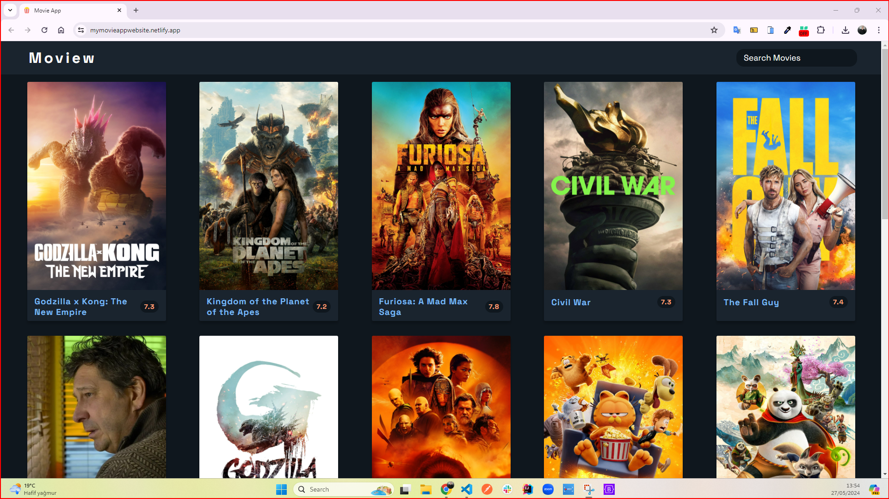
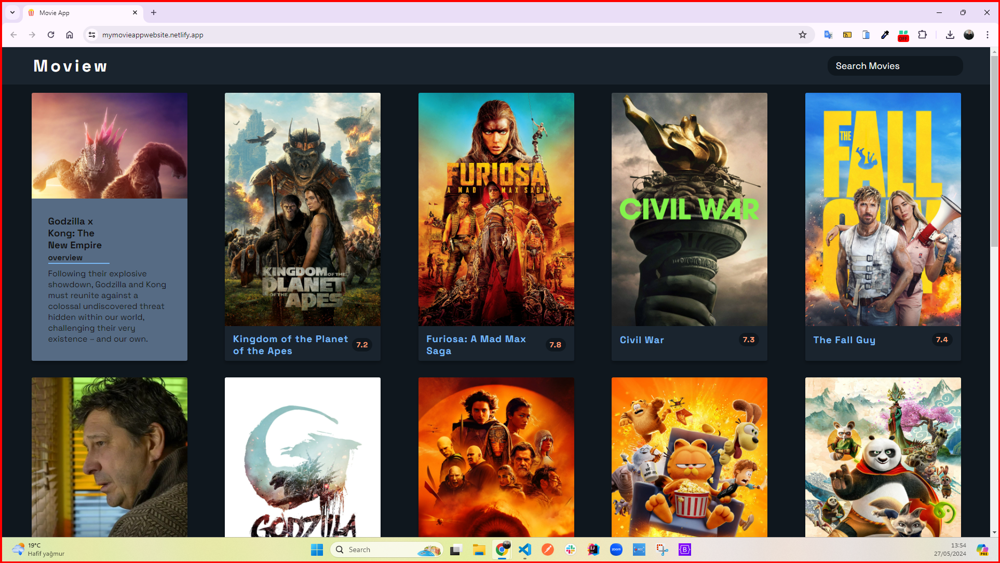
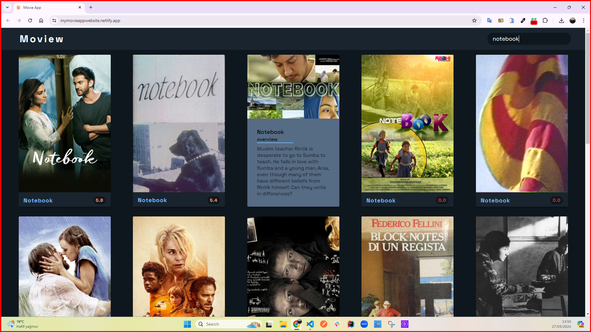

<h1>Movie App Project</h1>

This project is a movie application built using HTML5, CSS3, JavaScript, and an API. The app provides an easy way for movie lovers to discover and learn about movies. Users can search for the movie name or keywords to find the movie they want. Each movie has a poster, which helps users identify movies easily. Each movie has a synopsis that briefly summarizes the movie's plot and main characters, as well as a score for the movie. Users can view all these details with pleasure thanks to the beautiful interface of the site. My project runs responsively on every device screen.

<h2> The following technologies were used in the frontend development phase of my site: </h2>

- HTML5
- CSS3
- JavaScript
- API

<h2> Visit My Movie App Project: </h2>

- https://mymovieappwebsite.netlify.app/

<h4>GIF</h4>

<h4>IMAGES</h4>

